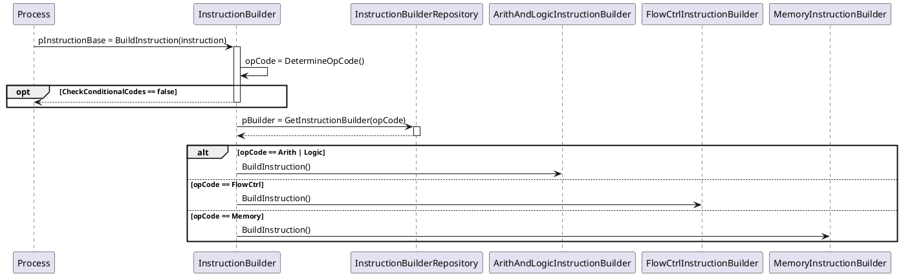
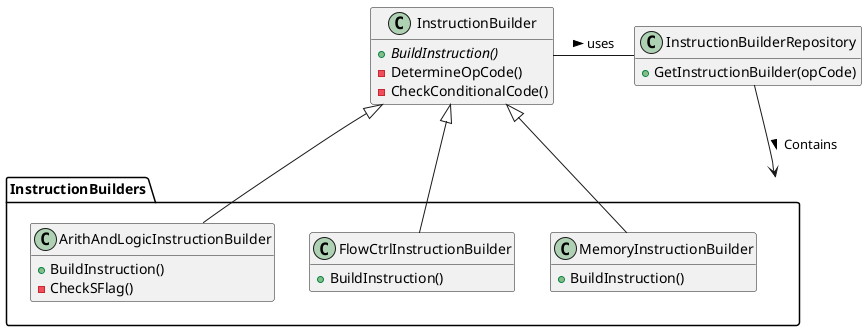
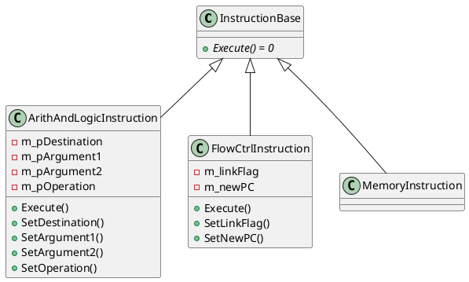

# Instruction Execution

```plantuml
@startuml

participant Process
participant InstructionBuilder as IB
participant InstructionBuilderRepository as IBR
participant ArithAndLogicInstructionBuilder as ALIB
participant FlowCtrlInstructionBuilder as FCIB
participant MemoryInstructionBuilder as MIB


Process -> IB: pInstructionBase = BuildInstruction(instruction)
activate IB

IB -> IB: opCode = DetermineOpCode()

opt CheckConditionalCodes == false
return
end

IB -> IBR: pBuilder = GetInstructionBuilder(opCode)
activate IBR
return

alt opCode == Arith | Logic
IB -> ALIB: BuildInstruction()

else opCode == FlowCtrl
IB -> FCIB: BuildInstruction()

else opCode == Memory
IB -> MIB: BuildInstruction()

end

@enduml
```

```plantuml
@startuml

hide fields

class InstructionBuilder
{
    {abstract} + BuildInstruction()
    - DetermineOpCode()
    - CheckConditionalCode()
}

class InstructionBuilderRepository
{
    + GetInstructionBuilder(opCode)
}

package InstructionBuilders
{

class ArithAndLogicInstructionBuilder
{
    + BuildInstruction()
    - CheckSFlag()
}

class FlowCtrlInstructionBuilder
{
    + BuildInstruction()
}

class MemoryInstructionBuilder
{
    + BuildInstruction()
}
}

InstructionBuilder <|-- ArithAndLogicInstructionBuilder
InstructionBuilder <|-- FlowCtrlInstructionBuilder
InstructionBuilder <|-- MemoryInstructionBuilder
InstructionBuilder - InstructionBuilderRepository : > uses
InstructionBuilderRepository --> InstructionBuilders : > Contains


@enduml
```

```plantuml
@startuml

class InstructionBase
{
    {abstract} + Execute() = 0
}

class ArithAndLogicInstruction
{
    - m_pDestination
    - m_pArgument1
    - m_pArgument2
    - m_pOperation
    + Execute()
    + SetDestination()
    + SetArgument1()
    + SetArgument2()
    + SetOperation()
}

class FlowCtrlInstruction
{
    - m_linkFlag
    - m_newPC
    + Execute()
    + SetLinkFlag()
    + SetNewPC()
}

class MemoryInstruction
{

}

InstructionBase <|-- ArithAndLogicInstruction
InstructionBase <|-- FlowCtrlInstruction
InstructionBase <|-- MemoryInstruction

@enduml
```
