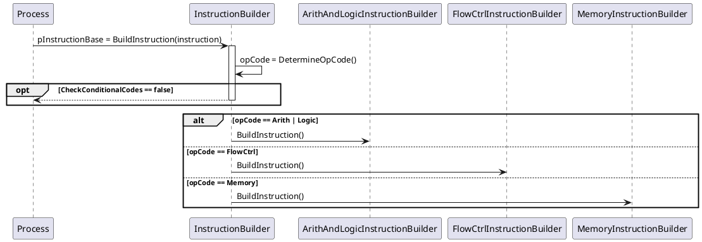
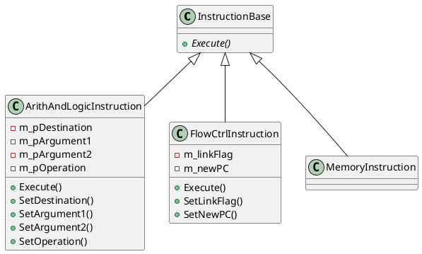

# Instruction Execution

```plantuml
@startuml

participant Process
participant InstructionBuilder as IB
participant ArithAndLogicInstructionBuilder as ALIB
participant FlowCtrlInstructionBuilder as FCIB
participant MemoryInstructionBuilder as MIB


Process -> IB: pInstructionBase = BuildInstruction(instruction)
activate IB

IB -> IB: opCode = DetermineOpCode()

opt CheckConditionalCodes == false
return
end

alt opCode == Arith | Logic
IB -> ALIB: BuildInstruction()

else opCode == FlowCtrl
IB -> FCIB: BuildInstruction()

else opCode == Memory
IB -> MIB: BuildInstruction()

end


@enduml
```

Steps to determining instruction type: \
1. Check if first letter is B
2. If so, compare against BIC, BLX, BX

```plantuml
@startuml

class InstructionBase
{
    {abstract} + Execute()
}

class ArithAndLogicInstruction
{
    - m_pDestination
    - m_pArgument1
    - m_pArgument2
    - m_pOperation
    + Execute()
    + SetDestination()
    + SetArgument1()
    + SetArgument2()
    + SetOperation()
}

class FlowCtrlInstruction
{
    - m_linkFlag
    - m_newPC
    + Execute()
    + SetLinkFlag()
    + SetNewPC()
}

class MemoryInstruction
{

}

InstructionBase <|-- ArithAndLogicInstruction
InstructionBase <|-- FlowCtrlInstruction
InstructionBase <|-- MemoryInstruction

@enduml
```
