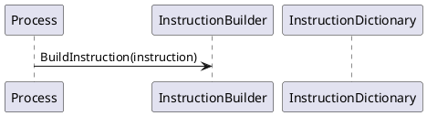

# Instruction Execution

```plantuml
@startuml

participant Process
participant InstructionBuilder as IB
participant InstructionDictionary as ID


Process -> IB: BuildInstruction(instruction)


@enduml
```