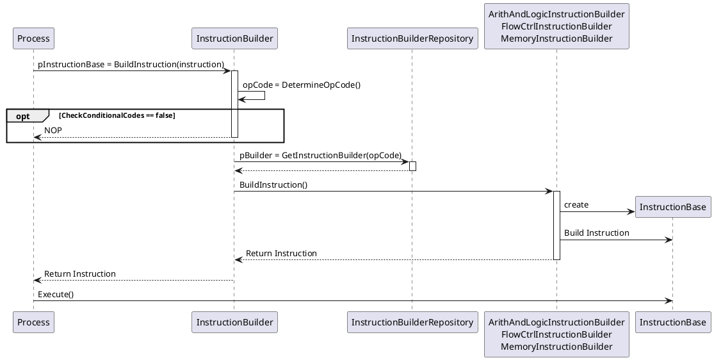
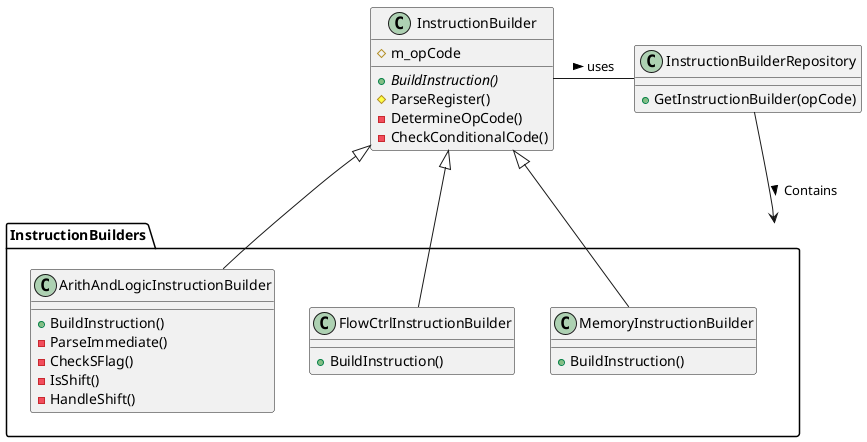
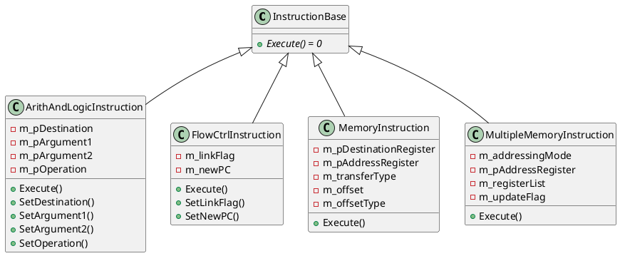

# Instruction Execution

```plantuml
@startuml

participant Process
participant InstructionBuilder as IB
participant InstructionBuilderRepository as IBR
participant "ArithAndLogicInstructionBuilder\nFlowCtrlInstructionBuilder\nMemoryInstructionBuilder" as builders
participant InstructionBase as base

Process -> IB: pInstructionBase = BuildInstruction(instruction)
activate IB

IB -> IB: opCode = DetermineOpCode()

opt CheckConditionalCodes == false
return NOP
end

IB -> IBR: pBuilder = GetInstructionBuilder(opCode)
activate IBR
return

IB -> builders: BuildInstruction()
activate builders
builders -> base ** : create
builders -> base: Build Instruction
return Return Instruction
IB --> Process: Return Instruction

Process -> base: Execute()

@enduml
```

```plantuml
@startuml

class InstructionBuilder
{
    {abstract} + BuildInstruction()
    # ParseRegister()
    - DetermineOpCode()
    - CheckConditionalCode()
    # m_opCode
}

class InstructionBuilderRepository
{
    + GetInstructionBuilder(opCode)
}

package InstructionBuilders
{

class ArithAndLogicInstructionBuilder
{
    + BuildInstruction()
    - ParseImmediate()
    - CheckSFlag()
    - IsShift()
    - HandleShift()
}

class FlowCtrlInstructionBuilder
{
    + BuildInstruction()
}

class MemoryInstructionBuilder
{
    + BuildInstruction()
}
}

InstructionBuilder <|-- ArithAndLogicInstructionBuilder
InstructionBuilder <|-- FlowCtrlInstructionBuilder
InstructionBuilder <|-- MemoryInstructionBuilder
InstructionBuilder - InstructionBuilderRepository : > uses
InstructionBuilderRepository --> InstructionBuilders : > Contains


@enduml
```

```plantuml
@startuml

class InstructionBase
{
    {abstract} + Execute() = 0
}

class ArithAndLogicInstruction
{
    - m_pDestination
    - m_pArgument1
    - m_pArgument2
    - m_pOperation
    + Execute()
    + SetDestination()
    + SetArgument1()
    + SetArgument2()
    + SetOperation()
}

class FlowCtrlInstruction
{
    - m_linkFlag
    - m_newPC
    + Execute()
    + SetLinkFlag()
    + SetNewPC()
}

class MemoryInstruction
{
    - m_pDestinationRegister
    - m_pAddressRegister
    - m_transferType
    - m_offset
    - m_offsetType
    + Execute()
}

class MultipleMemoryInstruction
{
    - m_addressingMode
    - m_pAddressRegister
    - m_registerList
    - m_updateFlag
    + Execute()
}

InstructionBase <|-- ArithAndLogicInstruction
InstructionBase <|-- FlowCtrlInstruction
InstructionBase <|-- MemoryInstruction
InstructionBase <|-- MultipleMemoryInstruction

@enduml
```
