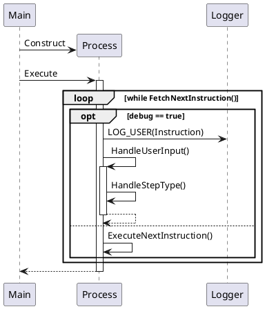

# Process Execution

```plantuml
@startuml

participant Main
participant Process
participant Logger

Main -> Process ** : Construct
Main -> Process : Execute
activate Process

loop while FetchNextInstruction()

opt debug == true
Process -> Logger : LOG_USER(Instruction)
Process -> Process : HandleUserInput()
activate Process
Process -> Process : HandleStepType()
return
else

Process -> Process : ExecuteNextInstruction()
end
end

return

@enduml
```