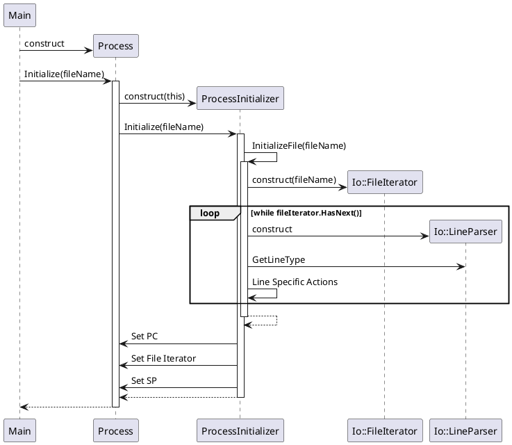

# Process Initialization

The process initialization procedure occurs at startup of the program. Using the file name provided by the user, a Process object is constructed. The main file and each additional included file are read. Information such as labels, static memory, and constants are initialized within the Process object itself. After returning from the `Initialize` method, the Process is ready for execution.

