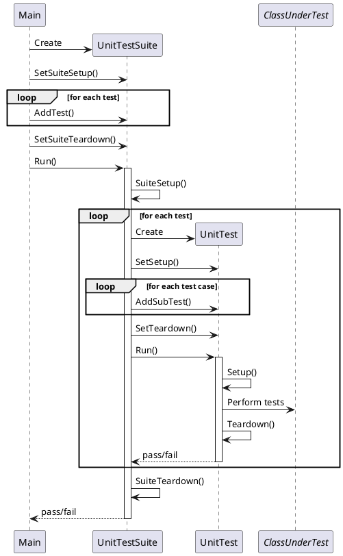

# Unit Testing Framework

Below is the sequence diagram for the unit testing framework. A test suite is constructed at the beginning. Individual unit tests are added to the suite. These indiviual unit tests are made up of separate test cases (sub tests) that are performed on the class under test. Both the suite and the individual unit tests have setup and teardown functions that can be customized for the purpose of the suite/unit test.

